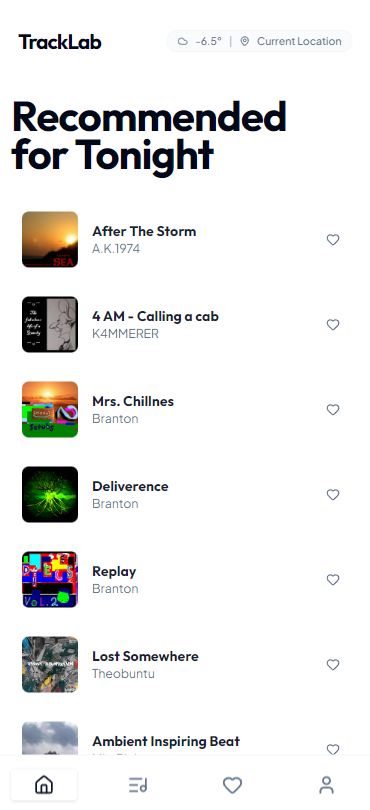

# TrackLab 🎵

A Context-Aware Music Dashboard built for an interview case study.
It suggests music based on your current **Weather** and **Location**.

## � Live Demo
[**Click to View Live App**](https://track-lab-iota.vercel.app/)

<p align="center">
  
</p>

## �🏗️ Tech Stack
-   **Frontend**: React (Vite) + Tailwind CSS
-   **Backend**: Node.js + Express + TypeScript
-   **Database**: PostgreSQL (Stores User Favorites)
-   **Cache**: Redis (Caches External API responses)
-   **APIs**:
    -   [Open-Meteo](https://open-meteo.com/) (Weather)
    -   [Jamendo](https://developer.jamendo.com/) (Music Search)

## 🎨 Design & UI (v2.0 Overhaul)
The application features a premium **Flat Editorial Design** focused on content and micro-interactions:
-   **Editorial Aesthetic**: High-contrast, bold typography with a "magazine" feel.
-   **Row Layout (List View)**: Dense, scannable track lists with horizontal cards.
-   **Capsule Notification**: A "Dynamic Island" style floating toast with a golden glow for likes.
-   **Capsule Player**: A floating persistent player with vinyl spin animations.
-   **Micro-interactions**: Subtle hover states, tactile button feedback, and smooth transitions.

## 🚀 Getting Started

### 1. Infrastructure
Start the databases (Postgres + Redis):
```bash
docker-compose up -d
```

### 2. Backend
Configure environment:
1.  Copy `server/.env.example` to `server/.env`
2.  Add your **Jamendo Client ID**.

Run the server:
```bash
cd server
npm install
npm run dev
```
Server runs on `http://localhost:3001`.

### 3. Frontend
```bash
cd client
npm install
npm run dev
```

## 🔌 API Endpoints

### Weather
`GET /api/weather?lat={lat}&lon={lon}`
-   Fetches current weather for coordinates.
-   Source: Open-Meteo.

### Music
`GET /api/music?vibe={tag}`
-   Fetches tracks matching a tag (e.g., 'rock', 'sunny').
-   **Cached in Redis** for 10 minutes to prevent rate-limiting.

### Favorites
`GET /api/favorites`
-   List saved tracks.

`POST /api/favorites`
-   Save a track to Postgres.
-   Body: `{ jamendo_id, name, artist_name, image, audio_url }`

`DELETE /api/favorites/:id`
-   Remove a favorite.
